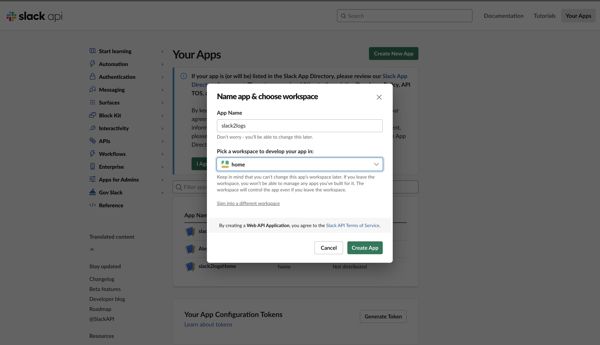
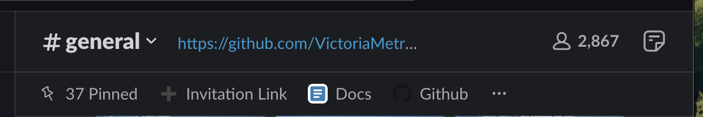

# slack2logs


Watch Slack messages and threads and send them to log storage.

**You can configure this application defining next flags:**

- `--envflag.enable` - enable reading flags from environment variables in addition to the command line; See: https://docs.victoriametrics.com/#environment-variables
- `--slack.channels` - channels ids from slack to listen messages
- `--slack.auth.botToken` - bot user OAuth token for Your Workspace
- `--slack.auth.appToken` - app-level tokens allow your app to use platform features that apply to multiple (or all) installations
- `--vmlogs.addr` - address with port for listening for HTTP requests
- `--vmlogs.auth.user` - username for VictoriaLogs HTTP server's Basic Auth
- `--vmlogs.auth.password` - password for VictoriaLogs HTTP server's Basic Auth

All messages from the defined channels will be converted to the [JSON](https://docs.victoriametrics.com/VictoriaLogs/data-ingestion/#json-stream-api)
and sent to the [VictoriaLogs](https://docs.victoriametrics.com/VictoriaLogs/#victorialogs).

**This application exposes two metrics at that time:**
- `vm_slack2logs_messages_received_total{source="slack"}`
  counts received messages from the Slack channels
- `vm_slack2logs_messages_out_total{source="slack"}`
  counts how many messages were sent to the victorialogs
- `vm_slack2logs_errors_total{source="slack"}`
  counts errors when getting messages from the Slack channels
- `vm_slack2logs_messages_delivery_total{destination="vmlogs"}`
  counts messages delivered to the destination
- `vm_slack2logs_delivery_errors_total{destination="vmlogs"}`
  counts errors when delivery message to the [VictoriaLogs](https://docs.victoriametrics.com/VictoriaLogs/#victorialogs)

## Setup slack application

To create slack application need to visit <a href="https://api.slack.com/apps?new_app=1">slack website</a>
and select `From scratch`.


Fill app name and workspace which you want to use



When app is created and enabled in a chosen workspace, it is required to create app-level token


Give the name of the app-leve-token and choose the scope. Slack2Logs application uses websocket communication, so 
Slack server should be able to route app interactions and event payloads to Websocket. in that case we need to choose
`connections:write` scope.


This token will be used in the slack2logs flag `-slack.auth.appToken`.

In the next step we should enable `Event subscription` and `Subscribe to bot event`.
In the image below shown the needed scopes to our app can subscribe to be notified of events in Slack


It is important to grant permissions to our applications that it can work with workspace where we wont to use it


Generated OAuth token will be used in the `-slack.auth.botToken`

When it successfully installed into workspace, we need to define the scopes that govern what slack2logs app can access. 


If some scopes are not defined, the application will show the error message and scope can be added later.

In the next iteration, we need to invite our application to the channels which this application needs to interact with.

Enter `/invite` in the message field and name of the application (`@slack2logs`) and press `Enter`.

When bot will be invited to the channel, we can start our application to listen to messages from the 
channels where the bot was invited. 

## How to run

If you want to run `slack2logs` you can make next commands from the repository root:
- `make slack2logs` - will prepare simple executable file with automatically GOOS;
- `make slack2logs-race` - made the same as previous command but also make checks of races;
- `make slack2logs-prod` - will prepare production ready executable file;
- `make package-slack2logs` - will prepare production ready executable files and docker containers for different architectures;
- `make publish-slack2logs` - will publish docker containers to [hub.docker.com](https://hub.docker.com).
  Please note that you will need to login to the hub.docker.com from terminal within your `username` and `token`. 
Token can be obtained at [https://hub.docker.com/settings/security](https://hub.docker.com/settings/security).

For the local run it is possible to run the next command:
```bash
./slack2logs \
  -slack.auth.botToken=xoxb-bot-token \
  -slack.auth.appToken=xapp-app-token \
  -slack.channels=ch1,ch2,ch3,ch4 \
  -vmlogs.auth.user=test-user \
  -vmlogs.auth.password=test-password
```

Slack channels can be found in the workspace where you are invited bot.
Enter channel and click into the header of the channel on channel name



After scroll down and copy the channel id


Use this copied channel in the `-slack.channels` flag of the application.

Secret which uses `slack2logs` defines in the 1password application.

On every push to the master branch application will be built and deployed to the Kubernetes.
All build file definitions you can find in the `deployment` folder

## CLI

This application helps to collect historical messages from defined slack channels repository.

If you want to run cli you need to compile it to binary and enable all flags that the application supports.

## Playground

The use of this tool can be seen at the link https://play-vmlogs.victoriametrics.com/select/vmui/.

Next, you need to select vmui in order to access the [VictoriaLogs UI](https://docs.victoriametrics.com/victorialogs/querying/#web-ui).

On the web interface, there is a field for queries, where you can use queries in VictoriaLogs. 
For more detailed information, refer to the [LogsQL documentation](https://docs.victoriametrics.com/victorialogs/logsql/).

Slack2Logs helps search and filter messages and threads that were written in a Slack channel and sent to storage in VictoriaLogs. 
This solution helps preserve messages for a longer period of time and allows flexible searching of useful information 
that was discussed in the channel.

Slack2Logs supports searching with multiple filters such as: 

```_stream:{channel_id="CGZF1H6L9", channel_name="general"}```

`_time` - time range for the search please check [time range](https://docs.victoriametrics.com/victorialogs/logsql/#time-filter)
`thread_ts` - timestamp of the thread (this timestamp always the same as the first message timestamp)
`display_name` - user name in the slack channel
`_stream` - it is a filter which provides an optimized way to select log entries. For more information please 
check [stream filter](https://docs.victoriametrics.com/victorialogs/logsql/#stream-filter).
 
Some of them will be discussed below in examples.

### How to query all messages for the specific channel

To view all existing messages from a specific channel, simply use the following filter:

```_time:120d _stream:{channel_id="CGZF1H6L9", channel_name="general"}```

To use this fileter you can specify one of the parameters `channel_id` or `channel_name`.
How to get `channel_id` was described above this section.

This filter will return all messages that were received from the specified channel for the last 120 days.
You can use time range filter to specify the needed time range from the UI.
By default, VictoriaLogs limits the number of lines to `1000`. 
So in the response you will able to see only `1000` messages

_Note:_

All Slack messages are collected to the batches and sent to the storage via the interval of time. 
So this logic should prevent duplicated messages when the user edits the message. 
But if the message is edited after the time limit, it can appear as duplicate.
Time interval for new messages to be appeared in the storage is `15 minute`.


### How to find messages by specific keywords of part of the message

To find a message by a keyword, you can refine the query using that word:

```_time:120d _stream:{channel_id="CGZF1H6L9", channel_name="general"} "I pass it in the helm values file"```

### How to get thread for the message

Some messages may have threads. To search for them, use the keyword and timestamps of the messages for thread search:

1. Search for information by keyword with any timestamp for that keyword expression.
```_time:120d _stream:{channel_id="CGZF1H6L9", channel_name="general"} "I pass it in the helm values file" and thread_ts:*```

1. Get the response of the initial message in the Slack channel and copy the timestamp value.

1. Search for all messages related to this thread.

```_time:120d _stream:{channel_id="CGZF1H6L9", channel_name="general"} and thread_ts:1705467634.457089```

or you can use `id` to find the thread

```_time:120d id:2c94a8f5c7aae30374990bfe55743b09f01ede62f613622f81895659168d0f75```

Also it is possible to find message with the specific part of the text and use it `id` to find the thread

### How to get messages related to user

To get message related to specific user you can simply use the next query

```_stream:{channel_id="CGZF1H6L9",channel_name="general"} display_name:"Zakhar Bessarab" "With the given 70K ingestion per minute, for the write path you can start with"```

To check the whole thread related to this message it is needed to do the next steps:

1. Make request with `thread_ts:*` field to get timestamp of this message 

```_time:120d _stream:{channel_id="CGZF1H6L9", channel_name="general"} "This is correct. You can find some more details on this here" display_name:"Zakhar Bessarab"```

If this message is the thread message you will able to see the `thread_ts` fields with value

1. To retrieve all nmessages related this thread just simplify the query to the next example

```_time:2023-09-21 _stream: {channel_id="CGZF1H6L9",channel_name="general"} thread_ts:1695270022.029689```

There are some simple search queries was shown for better search of the message. 

